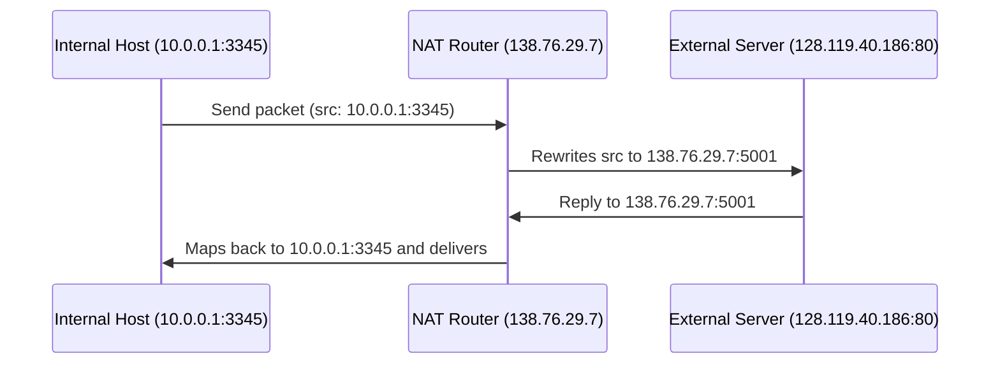
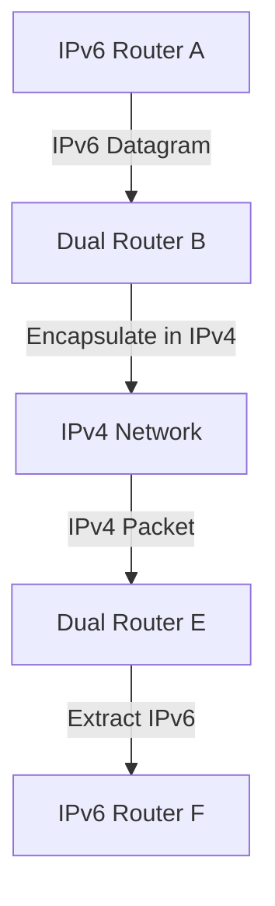
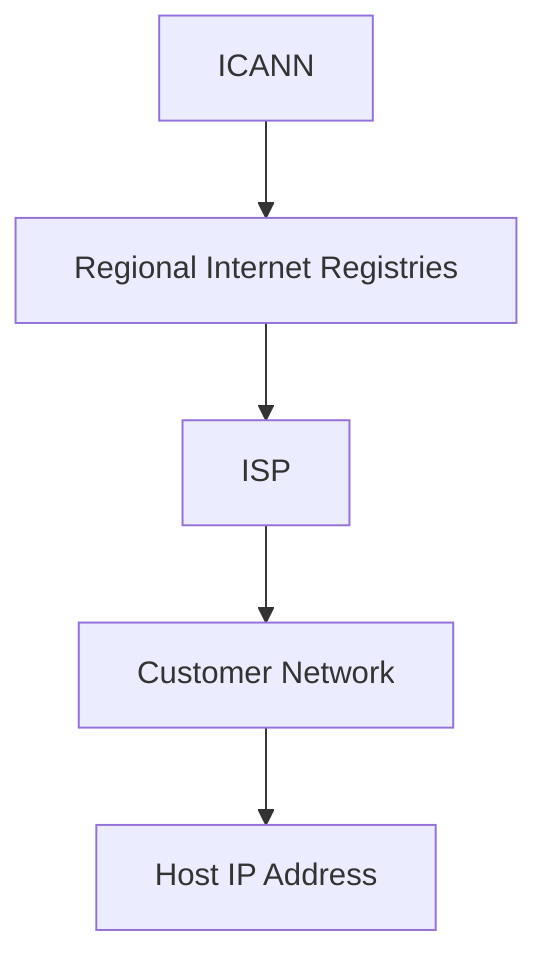
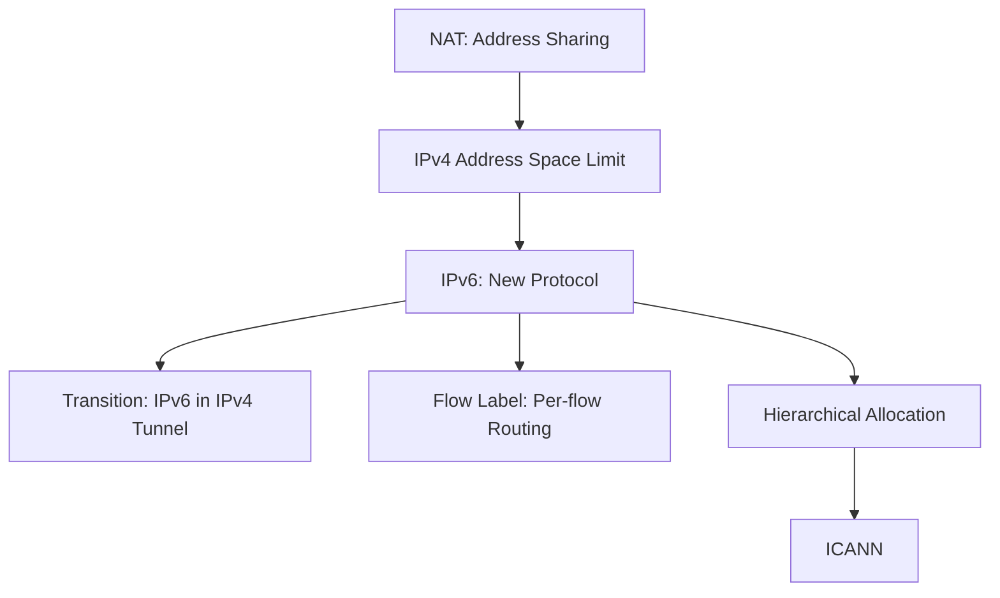

## Network Address Translation (NAT)

- NAT (Network Address Translation) enables multiple local devices to share a single public IPv4 address.
    
- Internal devices use private address spaces: 10/8, 172.16/12, or 192.168/16.
    
- NAT replaces source IP and port with its own public IP and a new port.
    
- It maintains a translation table to reverse the mapping for incoming packets.
    
- Benefits:
    
    - Only one public IP is needed.
        
    - Internal IPs can change without notifying the outside world.
        
    - Switching ISPs doesn't require renumbering internal devices.
        
    - Provides basic security: internal hosts aren't directly accessible from outside.
        
- Criticisms:
    
    - Violates end-to-end principle (layer 3 device alters transport-layer info).
        
    - NAT traversal is complex when external hosts initiate connections.
        
# How NAT is implemented

- **Network Address Translation (NAT)** is handled by a NAT-enabled router.
    
- For **outgoing datagrams**, the router:
    
    - Replaces the **source IP address and port** with the NAT router’s IP and a new source port.
        
- NAT is **transparent** to both local and remote hosts.
    
    - The remote host only sees the NAT IP and port and responds normally.
        
- The router keeps a **translation table** mapping:
    
    - Local source IP and port ↔ NAT IP and assigned port.
        
- For **incoming datagrams**, the router:
    
    - Replaces the **destination IP and port** with the local address and port stored in the table.

### Mermaid Diagram: NAT Workflow

---

## IPv6: Motivation and Innovations

- Main reason: IPv4's 32-bit space (≈4.3 billion) is insufficient.
    
- IPv6 uses 128-bit addresses—effectively infinite.
    
- Other improvements:
    
    - Simplified, fixed-length headers → faster processing.
        
    - Removed: checksum, fragmentation, reassembly, and options (done by endpoints or via extensions).
        
    - Introduced flow label field for identifying packet flows.
        
- Traffic Class field: similar to IPv4's Type of Service; defines priority but policy left to ISPs.
    

---

## IPv6 Datagram Format (Key Fields)

- Source Address: 128 bits
    
- Destination Address: 128 bits
    
- Payload Length
    
- Next Header (e.g., Transmission Control Protocol or User Datagram Protocol)
    
- Hop Limit (like TTL)
    
- Traffic Class (priority)
    
- Flow Label (optional, for packet flows)

- **IPv6** uses **128-bit source and destination addresses**.
    
- It includes a **16-bit flow label field** for identifying flows, but how flows are defined is up to the **ISP's policy**.
    
- The **8-bit traffic class field** works like IPv4's type of service field, used for **prioritizing traffic**.
    
- IPv6 defines **mechanisms**, not policies, for handling flow and priority.
    
- Common fields with IPv4: **version, payload length, hop limit, next header, and payload**.
    
- **IPv6 omits** certain IPv4 fields: **checksum, fragmentation/reassembly, and options**.
    
- This results in a **fixed-length header**, allowing for **faster processing**.
    
- **Fragmentation and reassembly** are handled at the **endpoints**, not by routers.
    
- **Options** are supported via **upper-layer protocols** instead of header fields.
    ![[Pasted image 20250519071229.png]]7

---

## IPv4 to IPv6 Transition

- Coexistence needed: can't switch the entire internet at once.
    
- Some routers are IPv4-only, some IPv6-only, and some dual-stack.
    
- Solution: Tunneling.
    

---

## Tunneling

- Encapsulates an IPv6 datagram inside an IPv4 datagram.
    
- Treats IPv4 network as a “virtual link” between two IPv6-capable routers.
    
- Enables IPv6 routers to communicate across an IPv4-only infrastructure.
    

### Mermaid Diagram: IPv6 Tunneling Through IPv4

### 🛰️ **Tunneling in Mixed IPv4/IPv6 Networks**

#### 🔍 **Scenario Overview:**

- **Routers A & F**: IPv6-only
    
- **Routers C & D**: IPv4-only
    
- **Routers B & E**: Dual-stack (support both IPv4 and IPv6)
    
- IPv6 router **A** wants to send an IPv6 datagram to IPv6 router **F**
    

---

#### 📡 **Step-by-Step Data Flow** _(Based on Diagram)_

1. **A → B (IPv6)**
    
    - Standard IPv6 forwarding:
        
        - **src=A, dest=F**, flow label included.
            
        - Routed to next hop B using IPv6.
            
2. **B → C/D/E (IPv6 inside IPv4 tunnel)**
    
    - **Challenge**: IPv6 packet must cross an **IPv4-only region**.
        
    - **Solution**: **Tunneling**
        
        - B wraps the IPv6 datagram inside an **IPv4 packet**.
            
        - IPv4 **outer packet**: `src=B, dest=E` (IPv4 addresses)
            
        - IPv6 **inner packet**: `src=A, dest=F`
            
        - Packet travels from **B → C → D → E** over IPv4 network.
            
3. **E → F (IPv6)**
    
    - E extracts the original IPv6 datagram from the IPv4 wrapper.
        
    - Forwards it to F using standard IPv6.
        

---

#### 🎯 **Key Concepts:**

- **Tunneling** allows IPv6 datagrams to be transmitted over an IPv4 infrastructure.
    
- The **IPv4 network acts as a tunnel**, connecting dual-stack routers.
    
- IPv4 is treated as a **link layer** between IPv6 endpoints.
    
- **Dual-stack routers (B and E)** serve as entry/exit points for the tunnel.
    
#### 🧠 **Takeaway:**

Tunneling ensures **coexistence and interoperability** between IPv4 and IPv6 by allowing IPv6 datagrams to be **encapsulated within IPv4 packets**, enabling communication across a mixed network path.

### Mermaid Diagram: Address Allocation Hierarchy

---

- NAT allows IPv4 reuse and hides internal network structure.
    
- IPv6 resolves address exhaustion and supports modern network demands.
    
- Tunneling ensures interoperability during transition.
    
- Address hierarchy enables scalable internet routing.
    
- Despite IPv6’s superiority, NAT and inertia keep IPv4 dominant.
    

---

## Final Integrated Mermaid Diagram: Related Concepts

