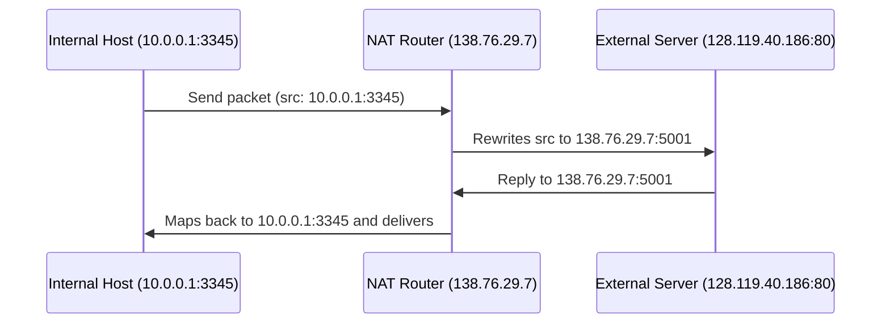
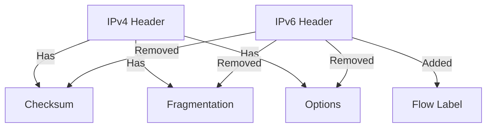
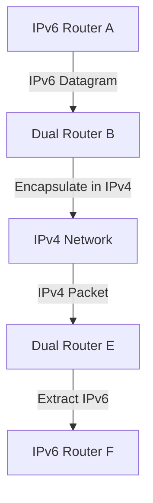
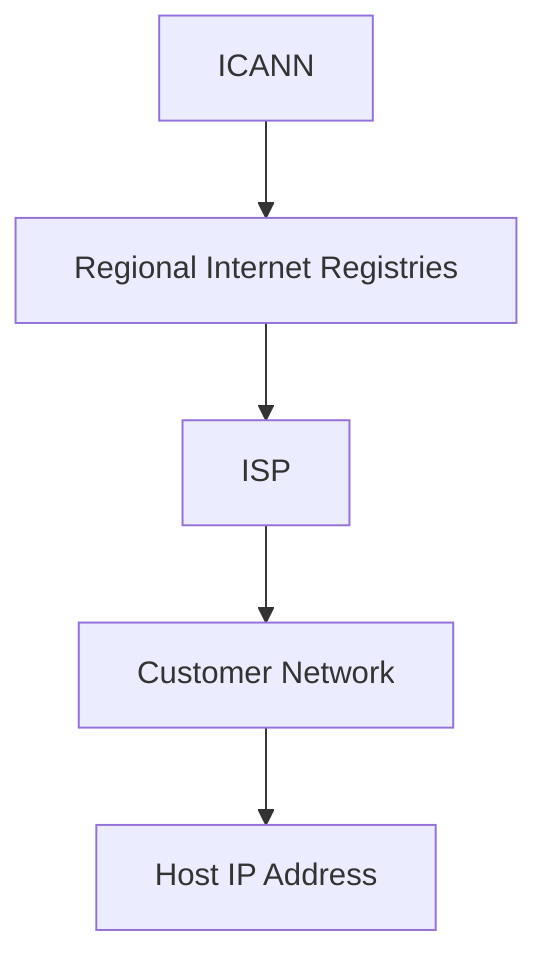
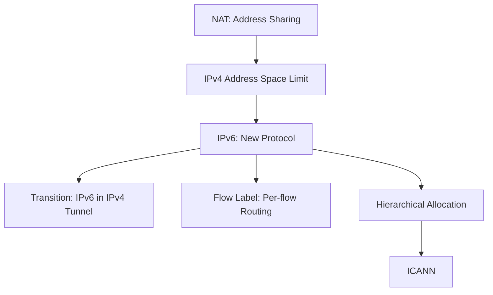

## Network Address Translation (NAT)

- NAT (Network Address Translation) enables multiple local devices to share a single public IPv4 address.
    
- Internal devices use private address spaces: 10/8, 172.16/12, or 192.168/16.
    
- NAT replaces source IP and port with its own public IP and a new port.
    
- It maintains a translation table to reverse the mapping for incoming packets.
    
- Benefits:
    
    - Only one public IP is needed.
        
    - Internal IPs can change without notifying the outside world.
        
    - Switching ISPs doesn't require renumbering internal devices.
        
    - Provides basic security: internal hosts aren't directly accessible from outside.
        
- Criticisms:
    
    - Violates end-to-end principle (layer 3 device alters transport-layer info).
        
    - NAT traversal is complex when external hosts initiate connections.
        

### Mermaid Diagram: NAT Workflow

---

## IPv6: Motivation and Innovations

- Main reason: IPv4's 32-bit space (≈4.3 billion) is insufficient.
    
- IPv6 uses 128-bit addresses—effectively infinite.
    
- Other improvements:
    
    - Simplified, fixed-length headers → faster processing.
        
    - Removed: checksum, fragmentation, reassembly, and options (done by endpoints or via extensions).
        
    - Introduced flow label field for identifying packet flows.
        
- Traffic Class field: similar to IPv4's Type of Service; defines priority but policy left to ISPs.
    

### Mermaid Diagram: IPv4 vs. IPv6 Header Differences

---

## IPv6 Datagram Format (Key Fields)

- Source Address: 128 bits
    
- Destination Address: 128 bits
    
- Payload Length
    
- Next Header (e.g., Transmission Control Protocol or User Datagram Protocol)
    
- Hop Limit (like TTL)
    
- Traffic Class (priority)
    
- Flow Label (optional, for packet flows)
    

---

## IPv4 to IPv6 Transition

- Coexistence needed: can't switch the entire internet at once.
    
- Some routers are IPv4-only, some IPv6-only, and some dual-stack.
    
- Solution: Tunneling.
    

---

## Tunneling

- Encapsulates an IPv6 datagram inside an IPv4 datagram.
    
- Treats IPv4 network as a “virtual link” between two IPv6-capable routers.
    
- Enables IPv6 routers to communicate across an IPv4-only infrastructure.
    

### Mermaid Diagram: IPv6 Tunneling Through IPv4

---

## Address Hierarchy and Aggregation

- ISPs receive blocks from regional registries (under ICANN — Internet Corporation for Assigned Names and Numbers).
    
- They divide and assign sub-blocks to customer organizations.
    
- Hierarchical model allows route summarization (aggregation).
    
- Longest prefix match is used to route accurately if an organization switches ISPs.
    

### Mermaid Diagram: Address Allocation Hierarchy

---

## Summary of Key Concepts in Slides 23–37

- NAT allows IPv4 reuse and hides internal network structure.
    
- IPv6 resolves address exhaustion and supports modern network demands.
    
- Tunneling ensures interoperability during transition.
    
- Address hierarchy enables scalable internet routing.
    
- Despite IPv6’s superiority, NAT and inertia keep IPv4 dominant.
    

---

## Final Integrated Mermaid Diagram: Related Concepts

