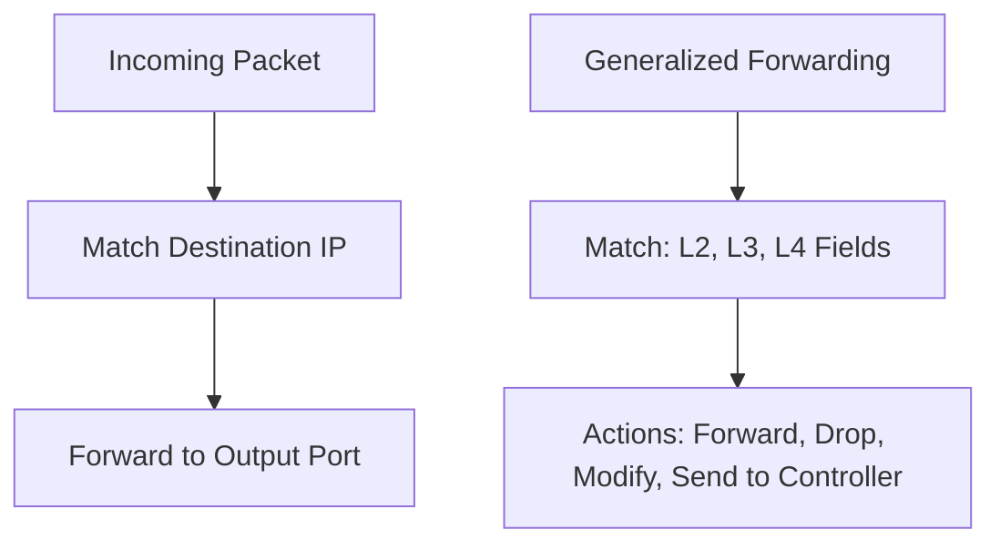
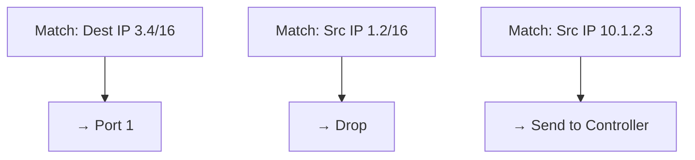
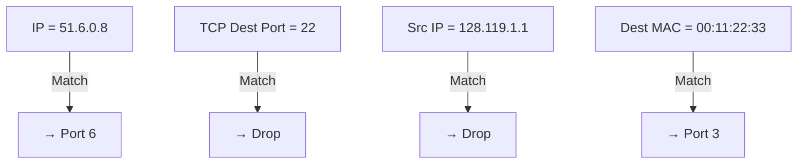
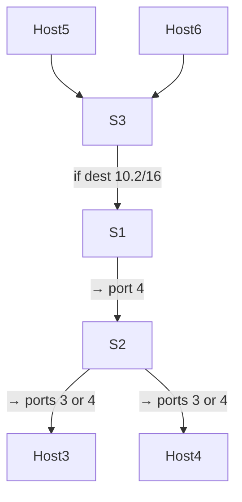
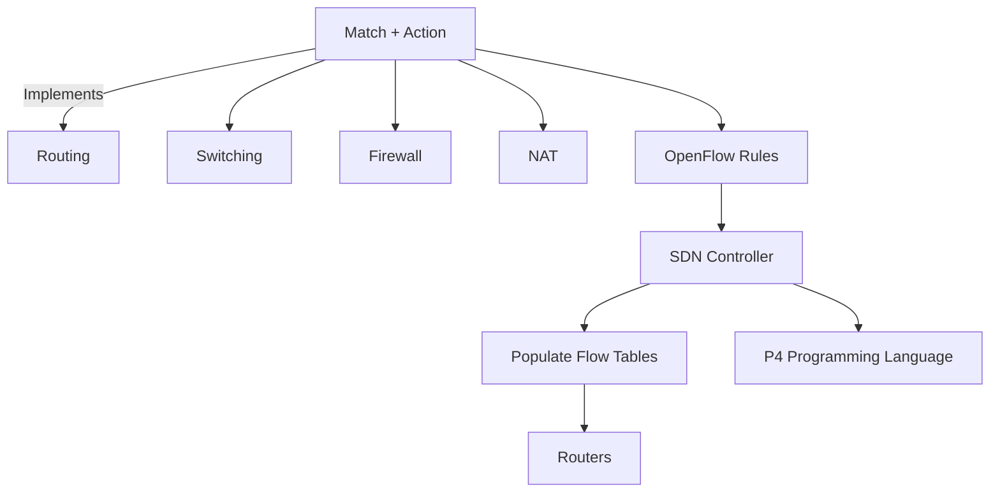

---

## Generalized Forwarding

- Traditional forwarding: router checks destination IP → forwards to output port (based on routing table).
    
- Generalized forwarding expands this:
    
    - Match can be on multiple fields (Layer 2, Layer 3, Layer 4).
        
    - Actions go beyond just forwarding: can drop, modify, encapsulate, or send to a controller.
        
- The match + action abstraction defines forwarding behavior:
    
    - Match on header fields.
        
    - Take an associated action.
        
- Flow Table = Match Rules + Actions + Optional Priorities & Counters.
    

### Mermaid Diagram: Traditional vs. Generalized Forwarding

---

## Flow Table: Match + Action Example

- Sample flow entries:
    
    1. Match dest IP 3.4/16 → forward to port 1
        
    2. Match source IP 1.2/16 → drop
        
    3. Match source IP 10.1.2.3 → send to SDN (Software Defined Networking) controller
        

### Mermaid Diagram: Simple Flow Table

---

## OpenFlow: Standard for Generalized Forwarding

- OpenFlow 1.0 allows matching on up to 12 header fields:
    
    - Layer 2: MAC address, Ethernet type, etc.
        
    - Layer 3: IP src/dst, protocol, TOS (Type of Service).
        
    - Layer 4: TCP/UDP src/dst ports.
        
- Actions supported:
    
    - Forward to one or more ports.
        
    - Drop.
        
    - Modify header fields.
        
    - Send to controller.
        

---

## OpenFlow Use Cases

- Example 1: Destination-based forwarding.
    
- Example 2: Firewall – block TCP (Transmission Control Protocol) port 22 (SSH).
    
- Example 3: Firewall – block packets from blacklisted host.
    
- Example 4: Link layer switch – forward by MAC address.
    

### Mermaid Diagram: OpenFlow Use Cases

---

## Match + Action = Unified Networking Behavior

- Can implement:
    
    - Layer 3 Routing
        
    - Layer 2 Switching
        
    - Firewall Rules
        
    - NAT-like header rewriting
        
- All under the same abstraction: match + action
    

---

## Network-Wide Behavior via SDN Controller

- If we can program each router’s forwarding table, we can control end-to-end routing.
    
- Forwarding tables can be:
    
    - Computed in an SDN controller.
        
    - Pushed to routers directly.
        
- Removes need for dynamic routing protocols (like OSPF or BGP).
    

---

## Example: Controller-Specified Routing Path

- Goal: Route packets from Host 5/6 to Host 3/4 via switch S1.
    
- Avoid direct S3→S2 path.
    

### Mermaid Diagram: Custom Forwarding Path

---

## Summary: Match + Action & Programmable Forwarding

- Match over multiple fields in L2, L3, L4 headers.
    
- Local actions: forward, drop, modify, send to controller.
    
- Enables:
    
    - Routing
        
    - Switching
        
    - Firewalling
        
    - NAT
        
- SDN controller can define network-wide policies by populating flow tables.
    
- Match + action = limited form of programmability.
    
    - Leads to programmable networks (e.g., via P4 programming language).
        

---

## Final Mermaid Diagram: Generalized Forwarding Ecosystem

