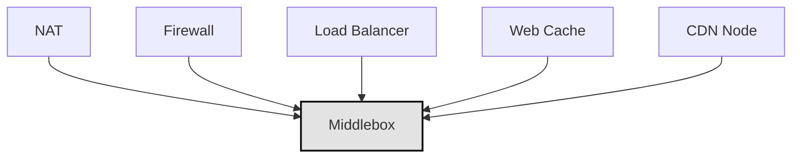
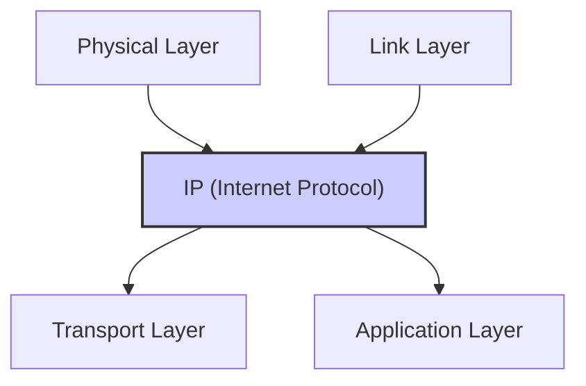
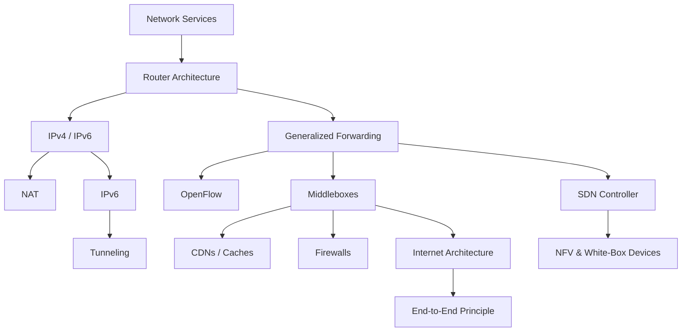

## Middleboxes

- A middlebox is any device between source and destination that performs non-standard router functions (i.e., beyond simple IP forwarding).
    
- RFC 3234 defines a middlebox as “any intermediary box performing functions apart from the normal, standard functions of an IP router.”
    
- Examples include:
    
    - NAT (Network Address Translation)
        
    - Firewalls
        
    - Load balancers (Layer 7 switches)
        
    - Web caches
        
    - Content Delivery Networks (CDNs)
        
- These are all considered data plane devices, not end-host functionality.
    
- Many are implemented using generalized forwarding (match + action abstraction).
    
- Modern middleboxes often use programmable white-box hardware + OpenFlow or APIs.
    

### Mermaid Diagram: Examples of Middleboxes

---

## Rise of White-Box Hardware and NFV

- Traditional middleboxes: proprietary hardware + software.
    
- New trend: white-box hardware with customizable software/ middle box functiom 
    
- Network Functions Virtualization (NFV):
    
    - Moves network logic (e.g., NAT, firewall, caching) into virtualized software.
        
    - Includes computing and storage.
        
- This is a software-driven redefinition of in-network services.
    

---

## IP Hourglass and Internet Architecture

- The “IP Hourglass” visualizes the internet’s layered structure:
    
    - Many protocols in physical, link, transport, application layers.
        
    - One protocol (IP) in the network layer.
        
- IP provides a common substrate that hides link-layer heterogeneity.
    
- The "thin waist" model emphasizes interoperability across diverse hardware and protocols.
    

### Mermaid Diagram: IP Hourglass

---

## End-to-End Principle

- Origin: "End-to-End Arguments in System Design" paper.
    
- Intelligence (e.g., reliability, congestion control) should be at the edges.
    
- Core idea: Some functions (like reliable delivery) “can be completely and correctly implemented only with the knowledge and help of the application at the endpoints.”
    
- That’s why TCP (Transmission Control Protocol) implements these functions at hosts rather than routers.
    

---

## Summary of Data Plane Module

We’ve explored the entire data plane of the Internet’s network layer:

1. Network Services (Best-effort delivery).
    
2. Router Internals:
    
    - Input/output ports
        
    - Switching fabric
        
    - Queuing and buffering
        
3. IPv4:
    
    - Datagram format
        
    - Addressing
        
    - NAT
        
4. IPv6:
    
    - Motivation, format, transition
        
    - Tunneling
        
5. Generalized Forwarding:
    
    - Match + action
        
    - OpenFlow
        
    - SDN concepts
        
6. Middleboxes & Architecture:
    
    - NAT, firewall, load balancing, caching
        
    - IP hourglass
        
    - End-to-end principle
        
    - Shift toward network programmability
        

---

## Final Integrated Mermaid Diagram: Data Plane Overview

