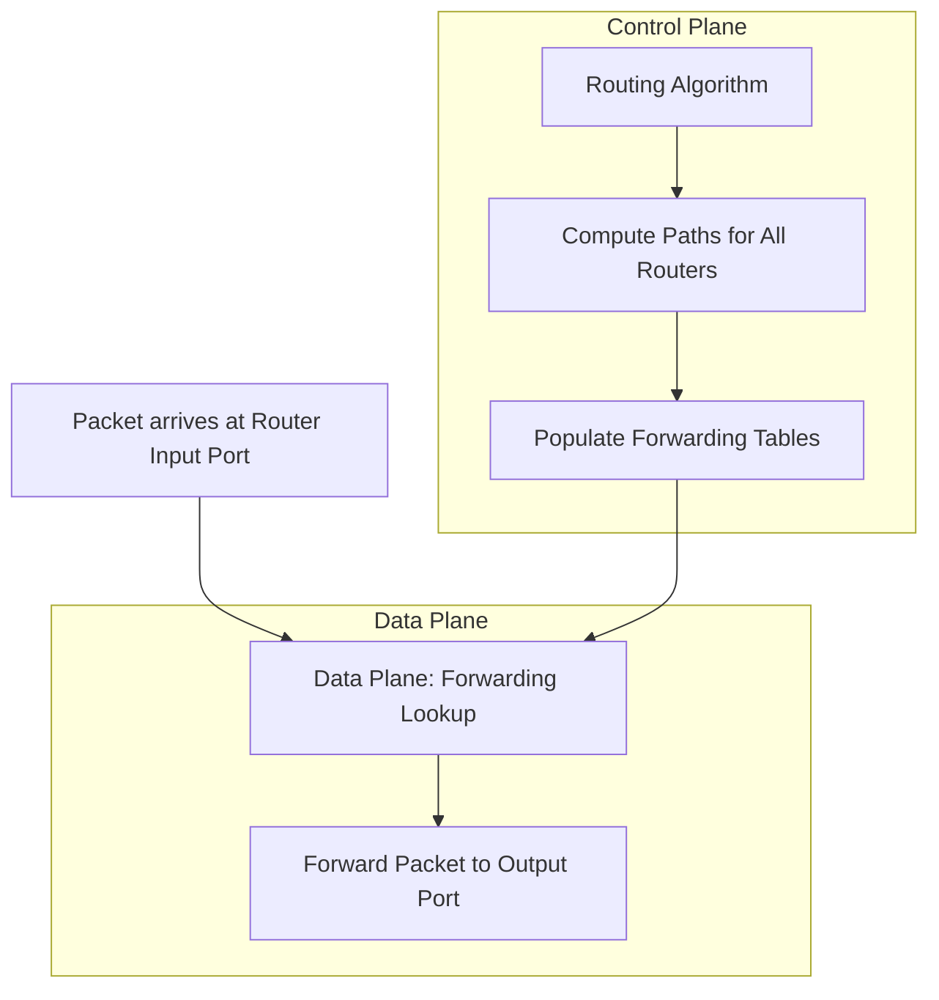
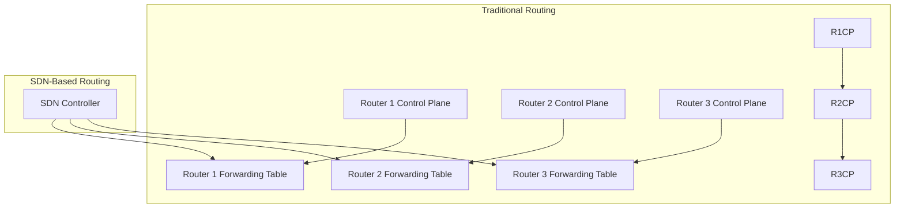

## Introduction to the Control Plane

- We shift focus from individual routers (data plane) to the network-wide logic that governs packet paths (control plane).
    
- The control plane manages:
    
    - Routing (path computation from source to destination)
        
    - Network management and configuration
        

---

## Control Plane Topics Overview

The course material covers both fundamental principles and their real-world implementations:

### Routing Algorithms

- Two foundational approaches:
    
    - Link-State (e.g., Dijkstra's algorithm)
        
    - Distance Vector (e.g., Bellman-Ford algorithm)
        

### Routing Protocols in Practice

- Open Shortest Path First (OSPF):
    
    - Intra-domain protocol based on link-state routing
        
- Border Gateway Protocol (BGP):
    
    - Inter-domain routing protocol
        
    - Often described as "the glue that holds the Internet together"
        

### Software-Defined Networking (SDN)

- Logically centralized control logic in SDN controllers
    
- Example platforms:
    
    - OpenDaylight (ODL)
        
    - ONOS (Open Network Operating System)
        
- OpenFlow protocol: enables SDN control over data plane elements
    

### Network Management & Configuration

- Internet Control Message Protocol (ICMP): diagnostic/control messages (e.g., ping, traceroute)
    
- Simple Network Management Protocol (SNMP): for monitoring and managing devices
    
- NETCONF + YANG: for configuration and state changes on routers and switches
    

---

## Forwarding vs. Routing: Key Distinction

- Forwarding:
    
    - Happens per router
        
    - Moves packets from input to output ports
        
    - Part of the data plane
        
- Routing:
    
    - Network-wide
        
    - Computes the paths that packets follow
        
    - Part of the control plane
        

---

## Two Control Plane Architectures

1. Per-Router Control Plane:
    
    - Each router runs its own routing algorithm
        
    - Routers exchange routing info to build their own forwarding tables
        
    - Example: traditional BGP or OSPF
        
2. Logically Centralized Control Plane (SDN):
    
    - Routing logic resides in a centralized controller
        
    - Controller computes forwarding tables and installs them in routers
        
    - Routers do not interact with each other for route computation
        

---

## Mermaid Diagram: Control Plane vs. Data Plane

---

## Mermaid Diagram: Per-Router vs SDN Control

Note: In the traditional approach, control is distributed across routers. In SDN, control is centralized.
