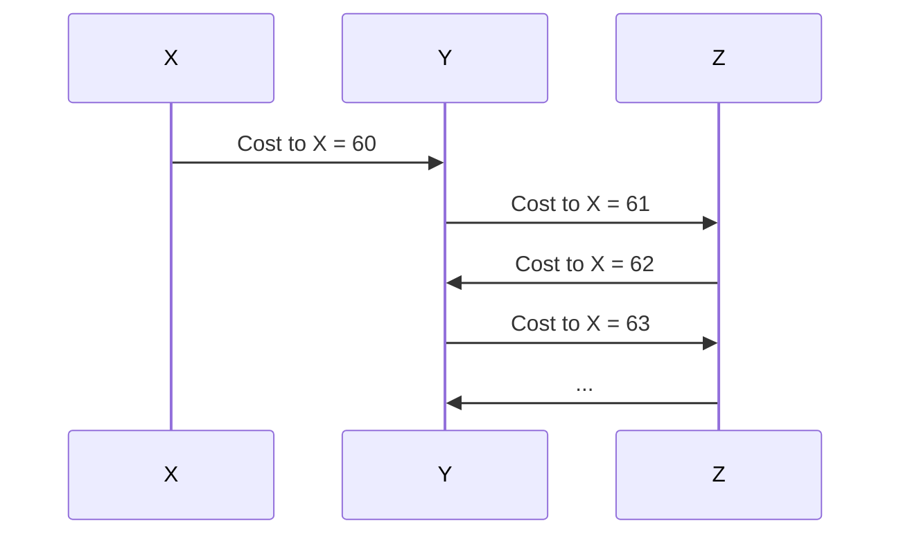

## Distance Vector Routing Algorithm (Bellman-Ford)

### Core Idea

- Each node computes the least-cost path to all destinations using:
    
    > Dx(y) = minv { c(x,v) + Dv(y) }
    
- Dx(y): Node x’s estimate of the cost to reach destination y
    
- c(x,v): Cost from node x to neighbor v
    
- Dv(y): Neighbor v’s estimate of cost to destination y
    

This recursive relationship is the Bellman-Ford equation. It only relies on local knowledge: the cost to neighbors and their advertised costs to destinations.

---

## Key Properties

- Fully distributed:
    
    - No node has full global topology
        
    - Each node exchanges distance vectors with immediate neighbors only
        
- Iterative and asynchronous:
    
    - Nodes update only when receiving changes
        
    - No global clock needed
        
- Self-terminating:
    
    - If no cost changes occur, nodes stop updating
        

---

## Algorithm Steps (Per Node)

1. Wait for:
    
    - A distance vector update from a neighbor, or
        
    - A local link cost change
        
2. Recalculate least-cost path estimates using Bellman-Ford equation
    
3. If any estimate changes:
    
    - Send updated distance vector to neighbors
        
4. Repeat
    

---

## Mermaid Diagram: Local Update Logic

```mermaid
graph TD
    A[Receive DV update or link cost change] --> B[For each destination y:]
    B --> C[Compute Dx(y) = min{c(x,v) + Dv(y)}]
    C --> D{Dx(y) changed?}
    D -->|Yes| E[Update Dx(y) and send to neighbors]
    D -->|No| F[Wait for next event]
```

---

## Example: DV Update to Reach Destination z

Assume:

- Node u has neighbors v, x, w
    
- Their reported costs to z are:
    
    - Dv(z) = 5
        
    - Dx(z) = 3
        
    - Dw(z) = 3
        
- u computes:
    
    - Du(z) = min{c(u,v)+5, c(u,x)+3, c(u,w)+3}
        
    - If c(u,x) = 1, Du(z) = 1+3 = 4
        

---

## Information Diffusion

- A node’s update slowly propagates through neighbors
    
- Each node “learns” about another node’s state after t hops over t time steps
    

⏱️ Analogy: Like seeing starlight from years ago—the info reflects past state.

---

## Reaction to Link Cost Changes

- Good news (link cost decreases):
    
    - Converges quickly
        
- Bad news (link cost increases):
    
    - May trigger slow and faulty convergence
        

---

## Count-to-Infinity Problem

Occurs when:

- A link cost increases sharply (e.g., from 4 to 60)
    
- Neighboring nodes bounce inflated values back and forth
    
- Nodes incrementally “count up” toward infinity
    

🧠 Example:

1. x to y becomes very expensive
    
2. y picks alternate path via z
    
3. z updates based on y, forming a loop
    
4. Both keep increasing estimates
    

🌀 This loop continues until cost stabilizes or a max hop count is reached.

---

## Mermaid Diagram: Count-to-Infinity Propagation



---

## Distance Vector vs. Link State: Summary

|Aspect|Link-State (Dijkstra)|Distance Vector (Bellman-Ford)|
|---|---|---|
|Info Required|Full topology|Neighbor distance vectors only|
|Communication|Broadcast link states (O(n²))|Updates to neighbors (varies)|
|Computation|Centralized, O(n²) per node|Distributed, per neighbor + destination|
|Convergence|Fast but can oscillate|Slower, risk of count-to-infinity|
|Robustness to Faults|Failures localized|Errors can propagate (e.g., blackholes)|

---

## Real-World Issues: Blackholing

- A misconfigured router advertises cost=0 to all destinations
    
- Routers send traffic toward it assuming shortest path
    
- The traffic is "blackholed" (dropped)
    
- This occurred in practice when a small ISP falsely advertised zero-cost paths to AT&T
    
