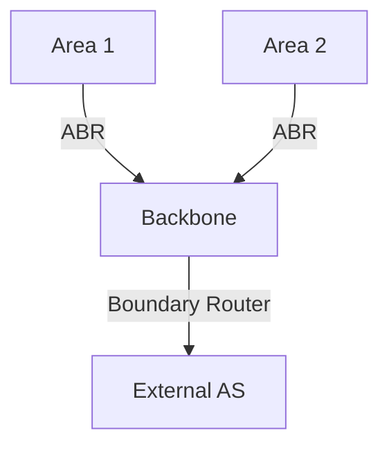
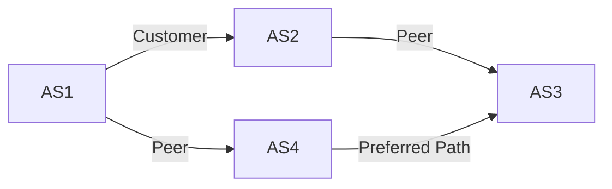
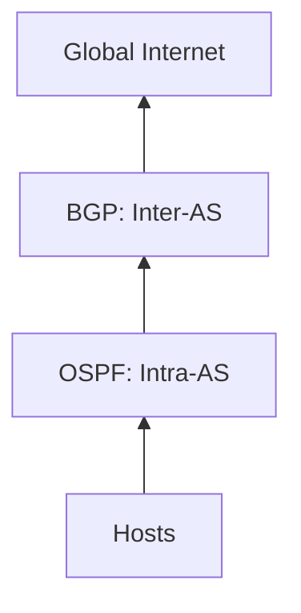

## **Internet Routing: Scaling and Autonomy**  
**Core Challenges**:  
1. **Scale**: Billions of endpoints → Forwarding tables can’t store all host entries.  
2. **Autonomy**: Networks (ASes) must control their own routing policies.  

**Solution**:  
- **Hierarchical Routing**: Split routing into:  
  - **Intra-AS (Intra-domain)**: Routing within a single network (e.g., OSPF).  
  - **Inter-AS (Inter-domain)**: Routing between networks (e.g., BGP).  

---

## **Intra-AS Routing: OSPF (Open Shortest Path First)**  
**Type**: Link-state protocol (uses Dijkstra’s algorithm).  
**Key Features**:  
- **Flooding LSAs**: Routers advertise link states to entire AS.  
- **Metrics**: Bandwidth, delay, etc.  
- **Authentication**: Secured LSAs to prevent spoofing.  
- **Hierarchical OSPF**:  
  - **Areas**: Local regions (e.g., Area 1, Area 2).  
  - **Backbone**: Connects areas; Area Border Routers (ABRs) summarize routes.  

**Mermaid Diagram**: OSPF Hierarchy  

**Why OSPF?**  
- Scalable (hierarchy limits LSA flooding).  
- Flexible (supports multiple cost metrics).  

---

## **Inter-AS Routing: BGP (Border Gateway Protocol)**  
**Role**: The "glue" of the Internet—routes traffic between ASes.  
**Key Features**:  
- **Path Vector Protocol**: Advertises full paths (not just metrics).  
- **Policy-Based**: ASes choose routes based on business rules (e.g., prefer customer routes over peer routes).  
- **Incremental Updates**: Only sends changes, not full tables.  

**BGP Example**:  
- **AS1** advertises path `AS1 → AS2 → AS3` to **AS4**.  
- **AS4** may prefer `AS1 → AS4` (shorter path) or `AS1 → AS2 → AS3` (cheaper transit).  

**Mermaid Diagram**: BGP Path Selection  

**Why BGP?**  
- **Scalability**: Aggregates routes (e.g., `/24` prefixes).  
- **Autonomy**: ASes enforce local policies (e.g., avoid competitors’ paths).  

---

## **Key Comparisons**  
| Protocol | Type          | Scope      | Key Use Case                     |  
|----------|---------------|------------|----------------------------------|  
| **OSPF** | Link-state    | Intra-AS   | Enterprise/campus networks.      |  
| **BGP**  | Path-vector   | Inter-AS   | ISP peering/Internet backbone.   |  

---

## **Acronyms**  
- **AS**: Autonomous System (a network under single admin).  
- **LSA**: Link-State Advertisement (OSPF updates).  
- **ABR**: Area Border Router (connects OSPF areas).  

---

### **Summary**  
- **OSPF**: Fast, scalable routing *within* a network (hierarchical LSAs).  
- **BGP**: Policy-driven routing *between* networks (path vectors + business rules).  
- **Hierarchy**: Critical for scaling (areas in OSPF, ASes in BGP).  

**Visualization**: Internet Routing Stack  

