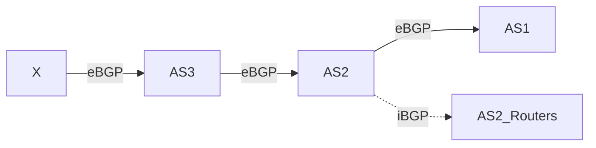
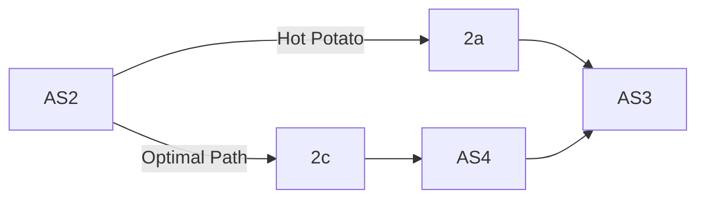
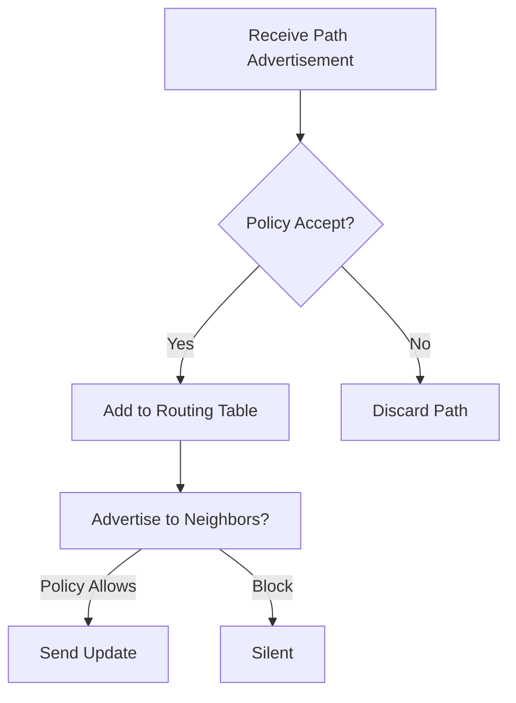

Here’s a structured summary of the BGP (Border Gateway Protocol) section, optimized for Obsidian with key concepts, Mermaid diagrams, and expanded acronyms:

---

## **BGP: The "Glue" of the Internet**  
**Role**: Inter-domain routing protocol for exchanging path information between Autonomous Systems (ASes).  
**Key Features**:  
- **Path Vector Protocol**: Advertises *full paths* (AS sequences) to destinations, not just metrics.  
- **Policy-Driven**: ASes choose routes based on business rules (e.g., avoid transit traffic).  
- **Incremental Updates**: Only sends changes, reducing overhead.  

---

### **BGP Basics**  
1. **eBGP vs. iBGP**:  
   - **eBGP**: Between ASes (e.g., AS1 ↔ AS2).  
   - **iBGP**: Within an AS (e.g., routers in AS1).  
2. **Path Advertisement**:  
   - Advertises **destination prefix** (e.g., `X/24`) + **AS_PATH** (e.g., `AS3 → X`).  
   - Example: AS3 advertises `AS3,X` to AS2 → AS2 learns path to X via AS3.  

**Mermaid Diagram**: BGP Path Propagation  

---

### **BGP Policy in Action**  
**Core Idea**: ASes control **what paths to advertise** and **what paths to accept**.  
- **Example Policies**:  
  - **No Transit**: AS2 refuses to carry traffic between non-customers (e.g., won’t advertise `B→A→W` to AS3).  
  - **Dual-Homed Customer**: X (connected to AS2/AS3) won’t advertise paths between AS2/AS3 to avoid transit.  

**Why Policy?**  
- **Economic Incentives**: ISPs prioritize customer traffic (revenue) over transit traffic (no profit).  
- **Security/Control**: Avoid routing through untrusted ASes/countries.  

---

### **Hot Potato Routing**  
**Rule**: Forward packets to the *closest* eBGP gateway (minimize internal cost).  
- **Trade-off**: May lead to suboptimal global paths (e.g., longer AS hops).  
- **Analogy**: Like "hot potato" — get rid of the packet ASAP!  

**Example**:  
- AS2’s router `2d` sends traffic to X via `2a` (closer) instead of `2c` (fewer AS hops).  

**Mermaid Diagram**: Hot Potato Routing  

---

### **BGP vs. OSPF**  
| Feature          | **BGP (Inter-AS)**               | **OSPF (Intra-AS)**               |  
|------------------|----------------------------------|-----------------------------------|  
| **Type**         | Path Vector                      | Link-State                        |  
| **Focus**        | Policy > Performance             | Shortest Path (Dijkstra)          |  
| **Scope**        | Global (AS-to-AS)                | Local (within AS)                 |  
| **Hierarchy**    | AS-level aggregation             | Areas + Backbone                  |  

---

### **Key Acronyms**  
- **AS**: Autonomous System (a network under single admin).  
- **AS_PATH**: BGP attribute listing ASes to reach a prefix.  
- **eBGP/iBGP**: External/Internal BGP.  

---

### **Summary**  
- **BGP’s Power**: Enables ASes to enforce policies (e.g., block transit, prefer customers).  
- **Scalability**: Aggregates routes (e.g., `/24` prefixes) and minimizes update traffic.  
- **Trade-offs**: Policy often outweighs performance (e.g., hot potato routing).  

**Visualization**: BGP Decision Flow  

