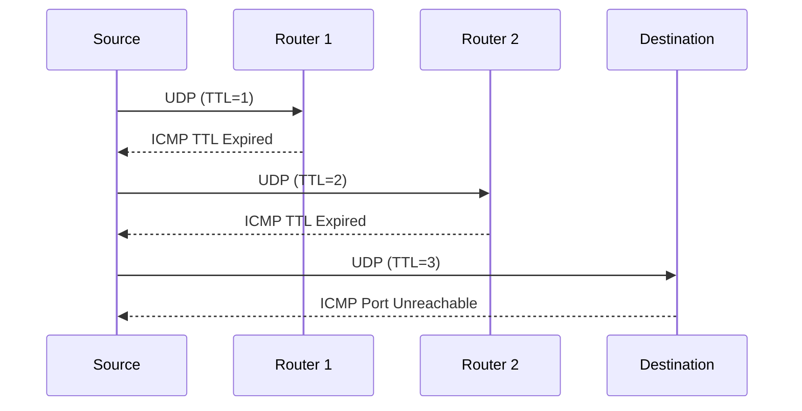
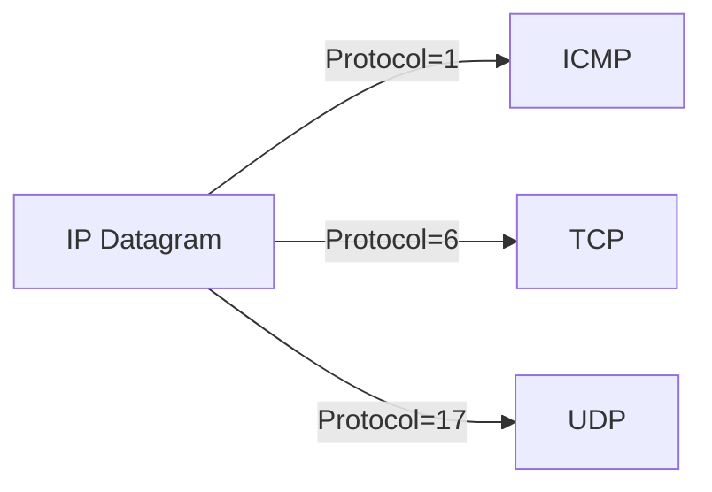

Here's a concise and structured summary of the ICMP (Internet Control Message Protocol) section, optimized for Obsidian with key concepts and visual aids:

---

## **ICMP: Internet Control Message Protocol**  
**Purpose**: Signal network-layer errors and diagnostics (e.g., unreachable hosts, TTL expiration).  
**Key Uses**:  
- Error reporting (e.g., "Destination Unreachable").  
- Network diagnostics (`ping`, `traceroute`).  

---

### **ICMP Basics**  
1. **Encapsulation**:  
   - ICMP messages are carried as IP datagram payloads (Protocol **#1**).  
   - Sibling to TCP/UDP but *not* a transport-layer protocol.  
2. **Message Format**:  
   - **Type** (1 byte): Error type (e.g., `11` = TTL expired).  
   - **Code** (1 byte): Subtype (e.g., `0` for TTL expired).  
   - **Checksum** (2 bytes): Integrity verification.  
   - **Payload**: First 8 bytes of offending datagram + optional data.  

**Common ICMP Types**:  

| Type | Code | Description               |  
|------|------|---------------------------|  
| `3`  | `3`  | Port Unreachable          |  
| `11` | `0`  | TTL Expired (for `traceroute`) |  
| `8`/`0` | - | Echo Request/Reply (`ping`) |  

---

### **How `traceroute` Uses ICMP**  
1. **Mechanics**:  
   - Sends UDP packets with incrementing TTL (start at `1`).  
   - Each router decrements TTL; if `TTL=0`, replies with ICMP **TTL Expired** (Type `11`).  
   - Source records router IP + RTT (round-trip time).  
2. **Termination**:  
   - Destination host typically replies with **Port Unreachable** (Type `3`, Code `3`).  

**Mermaid Diagram**: `traceroute` Workflow  

---

### **Key Points**  
- **Optional by RFC 792**: Routers *may* send ICMP errors (not guaranteed).  
- **Security Note**: ICMP can be exploited (e.g., ping floods), so some networks block it.  
- **Beyond `ping/traceroute`**: ICMP enables path MTU discovery, congestion feedback.  

**Visualization**: ICMP in IP Stack  

--- 

### **Summary**  
- **ICMP** is the internet’s "signal flare" for errors and diagnostics.  
- Critical for tools like `ping` (Echo Request/Reply) and `traceroute` (TTL Expired).  
- Lightweight but powerful (e.g., no ports, just IP-level messaging).  

Let me know if you’d like deeper dives into ICMP attacks (e.g., Smurf) or advanced uses!