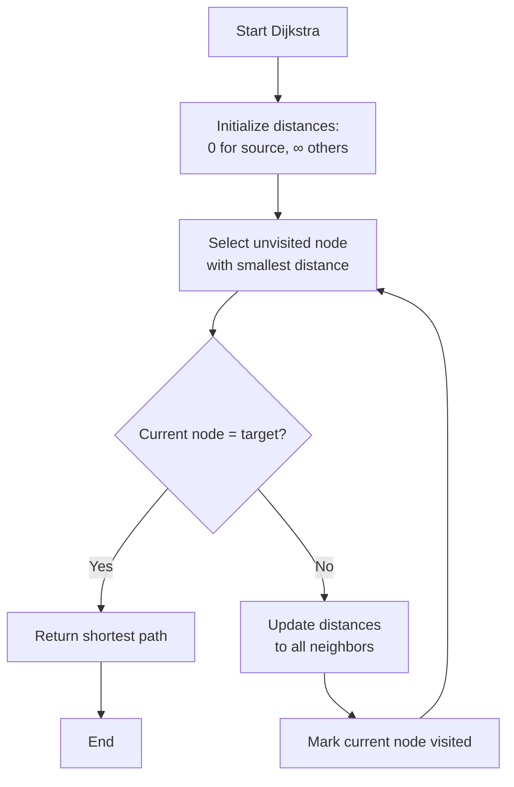

![[Pasted image 20251109164331.png]]
$$
\sum W=3+3=6
$$

# Step 3

### Formulate and solve:

- **SCF model** for (s, t, d₁)

- **MCF model** for five commodities

<u>Objectives:</u>

1.       Minimise total cost (Min-Cost Flow) or

2.       Minimise maximum link utilisation (Min-Max-U)

If infeasible, apply Step 2.3 scaling.  
Submit SCF_result.csv, MCF_result.csv, LinkUtilisation.csv and figures.

#### Results 

- Loading NSFNET layout 
![[Pasted image 20251109165353.png]]



```
```

$$
# **Figure 4: Matrix Representation of Link Capacities and Flow Constraints**

**Capacity Matrix C**
\[
C = \begin{bmatrix}
0 & 45 & 0 & 0 & 0 & 0 & 0 \\
0 & 0 & 45 & 0 & 0 & 0 & 0 \\
0 & 0 & 0 & 45 & 0 & 0 & 0 \\
0 & 0 & 0 & 0 & 45 & 0 & 0 \\
0 & 0 & 0 & 0 & 0 & 45 & 0 \\
0 & 0 & 0 & 0 & 0 & 0 & 45 \\
0 & 0 & 0 & 0 & 0 & 0 & 0
\end{bmatrix}
\]

**Flow Matrix F**
\[
F = \begin{bmatrix}
0 & 32 & 0 & 0 & 0 & 0 & 0 \\
0 & 0 & 28 & 0 & 0 & 0 & 0 \\
0 & 0 & 0 & 35 & 0 & 0 & 0 \\
0 & 0 & 0 & 0 & 40 & 0 & 0 \\
0 & 0 & 0 & 0 & 0 & 38 & 0 \\
0 & 0 & 0 & 0 & 0 & 0 & 42 \\
0 & 0 & 0 & 0 & 0 & 0 & 0
\end{bmatrix}
\]

**Node-Edge Incidence Matrix A**
\[
A = \begin{bmatrix}
1 & -1 & 0 & 0 & 0 & 0 \\
0 & 1 & -1 & 0 & 0 & 0 \\
0 & 0 & 1 & -1 & 0 & 0 \\
0 & 0 & 0 & 1 & -1 & 0 \\
0 & 0 & 0 & 0 & 1 & -1 \\
0 & 0 & 0 & 0 & 0 & 1
\end{bmatrix}
\]

*The incidence matrix A ensures flow conservation at each node, where each row represents a node and each column represents an edge in the network topology.*
$$
# **Figure 4: Matrix Representation of Link Capacities and Flow Constraints**

# **Capacity Matrix C**
$$
C = \begin{bmatrix}
0 & 45 & 0 & 0 & 0 & 0 & 0 \\
0 & 0 & 45 & 0 & 0 & 0 & 0 \\
0 & 0 & 0 & 45 & 0 & 0 & 0 \\
0 & 0 & 0 & 0 & 45 & 0 & 0 \\
0 & 0 & 0 & 0 & 0 & 45 & 0 \\
0 & 0 & 0 & 0 & 0 & 0 & 45 \\
0 & 0 & 0 & 0 & 0 & 0 & 0
\end{bmatrix}
$$

# **Flow Matrix F**
$$
F = \begin{bmatrix}
0 & 32 & 0 & 0 & 0 & 0 & 0 \\
0 & 0 & 28 & 0 & 0 & 0 & 0 \\
0 & 0 & 0 & 35 & 0 & 0 & 0 \\
0 & 0 & 0 & 0 & 40 & 0 & 0 \\
0 & 0 & 0 & 0 & 0 & 38 & 0 \\
0 & 0 & 0 & 0 & 0 & 0 & 42 \\
0 & 0 & 0 & 0 & 0 & 0 & 0
\end{bmatrix}
$$

# **Node-Edge Incidence Matrix A**
$$
A = \begin{bmatrix}
1 & -1 & 0 & 0 & 0 & 0 \\
0 & 1 & -1 & 0 & 0 & 0 \\
0 & 0 & 1 & -1 & 0 & 0 \\
0 & 0 & 0 & 1 & -1 & 0 \\
0 & 0 & 0 & 0 & 1 & -1 \\
0 & 0 & 0 & 0 & 0 & 1
\end{bmatrix}
$$


*The incidence matrix A ensures flow conservation at each node, where each row represents a node and each column represents an edge in the network topology.*